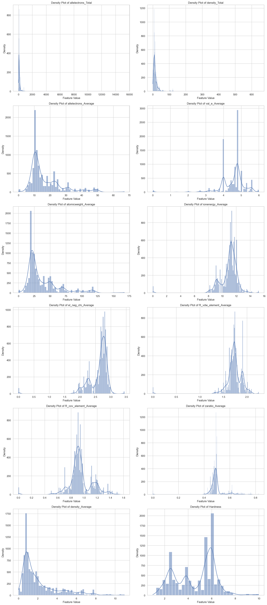
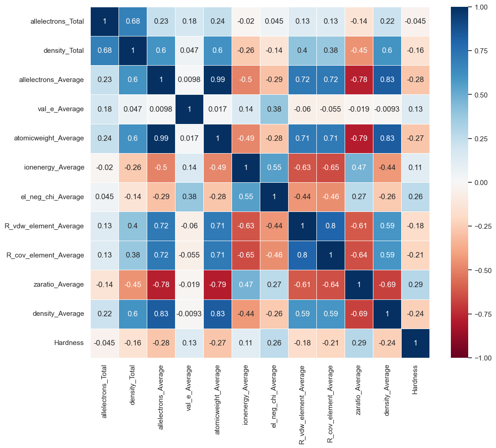
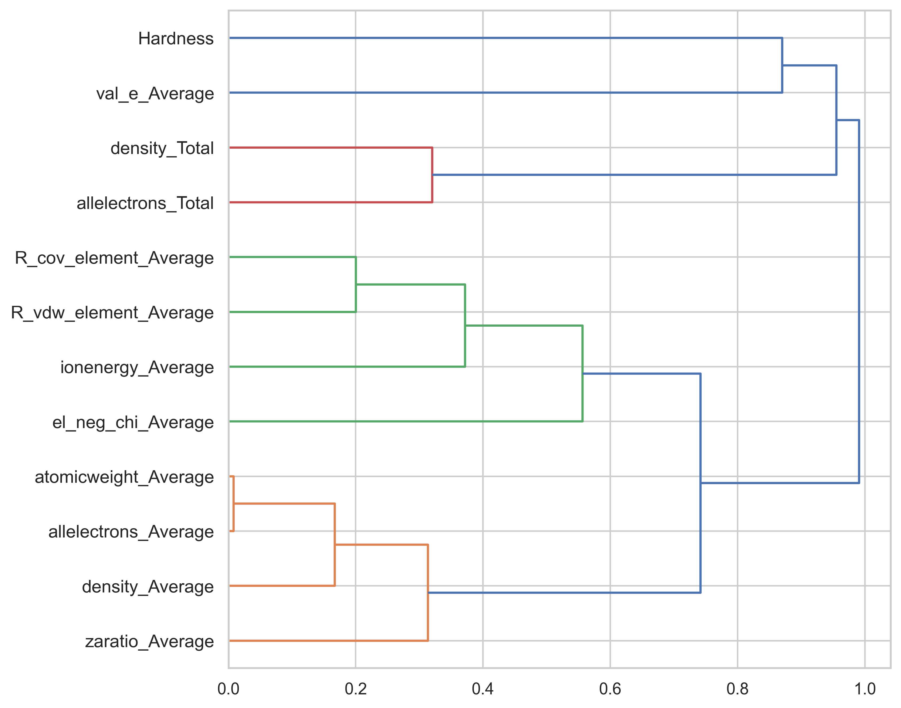
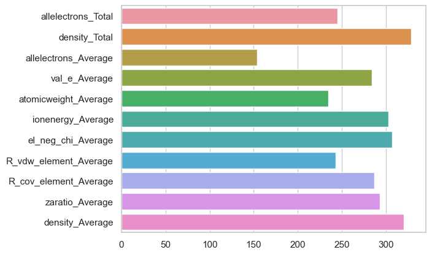

___

[Walter Reade, Ashley Chow. (2023). Regression with a Mohs Hardness Dataset. Kaggle.](https://kaggle.com/competitions/playground-series-s3e25)

___

<h1 style="background-color:red;font-family:newtimeroman;color:black;font-size:400%;text-align:center;border-radius: 50px 50px;">Regression with a Mohs Hardness Dataset</h1>

By [Ale uy](https://www.kaggle.com/lasm1984)

<a id="seccion1"></a>
# <h1 style="background-color:orange;font-family:newtimeroman;color:black;font-size:350%;text-align:center;border-radius: 50px 50px;">Notebook Description</h1>

**About the Tabular Playground Series**

The goal of the Tabular Playground Series is to provide the Kaggle community with a variety of fairly light-weight challenges that can be used to learn and sharpen skills in different aspects of machine learning and data science. The duration of each competition will generally only last a few weeks, and may have longer or shorter durations depending on the challenge. The challenges will generally use fairly light-weight datasets that are synthetically generated from real-world data, and will provide an opportunity to quickly iterate through various model and feature engineering ideas, create visualizations, etc.

**Synthetically-Generated Datasets**

Using synthetic data for Playground competitions allows us to strike a balance between having real-world data (with named features) and ensuring test labels are not publicly available. This allows us to host competitions with more interesting datasets than in the past. While there are still challenges with synthetic data generation, the state-of-the-art is much better now than when we started the Tabular Playground Series two years ago, and that goal is to produce datasets that have far fewer artifacts. Please feel free to give us feedback on the datasets for the different competitions so that we can continue to improve!

**Goal:** 

The task is to use regression to predict the Mohs hardness of a mineral, given its properties.

<a id="seccion2"></a>
# <h1 style="background-color:orange;font-family:newtimeroman;color:black;font-size:350%;text-align:center;border-radius: 50px 50px;">Loading Libraries</h1>

Main libraries for data manipulation, plots and customization


```python
import pandas as pd; pd.set_option('display.max_columns', 30)
import numpy as np

import matplotlib.pyplot as plt; plt.style.use('ggplot')
import seaborn as sns
import plotly.express as px

import warnings; warnings.filterwarnings("ignore")
```

We import the other libraries when you need them and thus avoid loading them if we try other methods

<a id="seccion3"></a>
# <h1 style="background-color:orange;font-family:newtimeroman;color:black;font-size:350%;text-align:center;border-radius: 50px 50px;">Reading Data Files</h1> 


```python
train = pd.read_csv('train.csv')
test = pd.read_csv('test.csv')
```


```python
train.info()
```

    <class 'pandas.core.frame.DataFrame'>
    RangeIndex: 10407 entries, 0 to 10406
    Data columns (total 13 columns):
     #   Column                 Non-Null Count  Dtype  
    ---  ------                 --------------  -----  
     0   id                     10407 non-null  int64  
     1   allelectrons_Total     10407 non-null  float64
     2   density_Total          10407 non-null  float64
     3   allelectrons_Average   10407 non-null  float64
     4   val_e_Average          10407 non-null  float64
     5   atomicweight_Average   10407 non-null  float64
     6   ionenergy_Average      10407 non-null  float64
     7   el_neg_chi_Average     10407 non-null  float64
     8   R_vdw_element_Average  10407 non-null  float64
     9   R_cov_element_Average  10407 non-null  float64
     10  zaratio_Average        10407 non-null  float64
     11  density_Average        10407 non-null  float64
     12  Hardness               10407 non-null  float64
    dtypes: float64(12), int64(1)
    memory usage: 1.0 MB
    


```python
test.info()
```

    <class 'pandas.core.frame.DataFrame'>
    RangeIndex: 6939 entries, 0 to 6938
    Data columns (total 12 columns):
     #   Column                 Non-Null Count  Dtype  
    ---  ------                 --------------  -----  
     0   id                     6939 non-null   int64  
     1   allelectrons_Total     6939 non-null   float64
     2   density_Total          6939 non-null   float64
     3   allelectrons_Average   6939 non-null   float64
     4   val_e_Average          6939 non-null   float64
     5   atomicweight_Average   6939 non-null   float64
     6   ionenergy_Average      6939 non-null   float64
     7   el_neg_chi_Average     6939 non-null   float64
     8   R_vdw_element_Average  6939 non-null   float64
     9   R_cov_element_Average  6939 non-null   float64
     10  zaratio_Average        6939 non-null   float64
     11  density_Average        6939 non-null   float64
    dtypes: float64(11), int64(1)
    memory usage: 650.7 KB
    

### Separate '`id`' and the target '`Hardness`'


```python
train_id = train['id']
train.drop('id', axis=1, inplace=True)

test_id = test['id']
test.drop('id', axis=1, inplace=True)

TARGET = 'Hardness'
```

<a id="seccion4"></a>
# <h1 style="background-color:orange;font-family:newtimeroman;color:black;font-size:350%;text-align:center;border-radius: 50px 50px;">Data Exploration</h1>

## Dataset Description


```python
train.describe().T
```


<div>
<style scoped>
    .dataframe tbody tr th:only-of-type {
        vertical-align: middle;
    }

    .dataframe tbody tr th {
        vertical-align: top;
    }

    .dataframe thead th {
        text-align: right;
    }
</style>
<table border="1" class="dataframe">
  <thead>
    <tr style="text-align: right;">
      <th></th>
      <th>count</th>
      <th>mean</th>
      <th>std</th>
      <th>min</th>
      <th>25%</th>
      <th>50%</th>
      <th>75%</th>
      <th>max</th>
    </tr>
  </thead>
  <tbody>
    <tr>
      <th>allelectrons_Total</th>
      <td>10407.0</td>
      <td>128.053516</td>
      <td>224.123776</td>
      <td>0.0</td>
      <td>68.000000</td>
      <td>100.000000</td>
      <td>131.000000</td>
      <td>15300.000000</td>
    </tr>
    <tr>
      <th>density_Total</th>
      <td>10407.0</td>
      <td>14.491342</td>
      <td>15.972877</td>
      <td>0.0</td>
      <td>7.558488</td>
      <td>10.650000</td>
      <td>16.676996</td>
      <td>643.093804</td>
    </tr>
    <tr>
      <th>allelectrons_Average</th>
      <td>10407.0</td>
      <td>17.033222</td>
      <td>10.468734</td>
      <td>0.0</td>
      <td>10.000000</td>
      <td>12.600000</td>
      <td>22.000000</td>
      <td>67.000000</td>
    </tr>
    <tr>
      <th>val_e_Average</th>
      <td>10407.0</td>
      <td>4.546789</td>
      <td>0.690864</td>
      <td>0.0</td>
      <td>4.000000</td>
      <td>4.714286</td>
      <td>4.800000</td>
      <td>6.000000</td>
    </tr>
    <tr>
      <th>atomicweight_Average</th>
      <td>10407.0</td>
      <td>37.507703</td>
      <td>26.012313</td>
      <td>0.0</td>
      <td>20.298893</td>
      <td>26.203827</td>
      <td>48.719500</td>
      <td>167.400000</td>
    </tr>
    <tr>
      <th>ionenergy_Average</th>
      <td>10407.0</td>
      <td>10.938308</td>
      <td>1.408276</td>
      <td>0.0</td>
      <td>10.590660</td>
      <td>11.202760</td>
      <td>11.670725</td>
      <td>15.245810</td>
    </tr>
    <tr>
      <th>el_neg_chi_Average</th>
      <td>10407.0</td>
      <td>2.607662</td>
      <td>0.334906</td>
      <td>0.0</td>
      <td>2.530000</td>
      <td>2.706000</td>
      <td>2.805000</td>
      <td>3.443000</td>
    </tr>
    <tr>
      <th>R_vdw_element_Average</th>
      <td>10407.0</td>
      <td>1.731330</td>
      <td>0.192481</td>
      <td>0.0</td>
      <td>1.672500</td>
      <td>1.732727</td>
      <td>1.800000</td>
      <td>2.250000</td>
    </tr>
    <tr>
      <th>R_cov_element_Average</th>
      <td>10407.0</td>
      <td>0.944132</td>
      <td>0.180017</td>
      <td>0.0</td>
      <td>0.864000</td>
      <td>0.915556</td>
      <td>0.981667</td>
      <td>1.615840</td>
    </tr>
    <tr>
      <th>zaratio_Average</th>
      <td>10407.0</td>
      <td>0.493349</td>
      <td>0.063080</td>
      <td>0.0</td>
      <td>0.476196</td>
      <td>0.488550</td>
      <td>0.496070</td>
      <td>0.825990</td>
    </tr>
    <tr>
      <th>density_Average</th>
      <td>10407.0</td>
      <td>2.132984</td>
      <td>1.936656</td>
      <td>0.0</td>
      <td>0.814800</td>
      <td>1.351550</td>
      <td>2.741550</td>
      <td>10.970000</td>
    </tr>
    <tr>
      <th>Hardness</th>
      <td>10407.0</td>
      <td>4.647126</td>
      <td>1.680525</td>
      <td>1.0</td>
      <td>3.000000</td>
      <td>5.500000</td>
      <td>6.000000</td>
      <td>10.000000</td>
    </tr>
  </tbody>
</table>
</div>


### Nulls Values


```python
train.isna().sum().sort_values(ascending=False) / train.shape[0] * 100
```


    allelectrons_Total       0.0
    density_Total            0.0
    allelectrons_Average     0.0
    val_e_Average            0.0
    atomicweight_Average     0.0
    ionenergy_Average        0.0
    el_neg_chi_Average       0.0
    R_vdw_element_Average    0.0
    R_cov_element_Average    0.0
    zaratio_Average          0.0
    density_Average          0.0
    Hardness                 0.0
    dtype: float64


```python
test.isna().sum().sort_values(ascending=False) / test.shape[0] * 100
```


    allelectrons_Total       0.0
    density_Total            0.0
    allelectrons_Average     0.0
    val_e_Average            0.0
    atomicweight_Average     0.0
    ionenergy_Average        0.0
    el_neg_chi_Average       0.0
    R_vdw_element_Average    0.0
    R_cov_element_Average    0.0
    zaratio_Average          0.0
    density_Average          0.0
    dtype: float64


### Duplicate Values


```python
train.duplicated().sum()
```


    0


```python
# train.drop_duplicates(inplace=True)
```


```python
test.duplicated().sum()
```


    0


### Kurtosis and Skew


```python
pd.DataFrame({'train': train.kurtosis(), 'test': test.kurtosis()})
```


<div>
<style scoped>
    .dataframe tbody tr th:only-of-type {
        vertical-align: middle;
    }

    .dataframe tbody tr th {
        vertical-align: top;
    }

    .dataframe thead th {
        text-align: right;
    }
</style>
<table border="1" class="dataframe">
  <thead>
    <tr style="text-align: right;">
      <th></th>
      <th>train</th>
      <th>test</th>
    </tr>
  </thead>
  <tbody>
    <tr>
      <th>Hardness</th>
      <td>-0.793775</td>
      <td>NaN</td>
    </tr>
    <tr>
      <th>R_cov_element_Average</th>
      <td>5.156704</td>
      <td>5.075099</td>
    </tr>
    <tr>
      <th>R_vdw_element_Average</th>
      <td>40.696122</td>
      <td>40.880686</td>
    </tr>
    <tr>
      <th>allelectrons_Average</th>
      <td>2.740956</td>
      <td>2.668006</td>
    </tr>
    <tr>
      <th>allelectrons_Total</th>
      <td>2383.425529</td>
      <td>1556.276209</td>
    </tr>
    <tr>
      <th>atomicweight_Average</th>
      <td>3.332072</td>
      <td>3.227547</td>
    </tr>
    <tr>
      <th>density_Average</th>
      <td>2.422794</td>
      <td>2.115909</td>
    </tr>
    <tr>
      <th>density_Total</th>
      <td>259.161522</td>
      <td>313.397231</td>
    </tr>
    <tr>
      <th>el_neg_chi_Average</th>
      <td>22.175230</td>
      <td>20.556445</td>
    </tr>
    <tr>
      <th>ionenergy_Average</th>
      <td>24.733284</td>
      <td>23.335279</td>
    </tr>
    <tr>
      <th>val_e_Average</th>
      <td>12.494568</td>
      <td>11.225967</td>
    </tr>
    <tr>
      <th>zaratio_Average</th>
      <td>24.828071</td>
      <td>27.667758</td>
    </tr>
  </tbody>
</table>
</div>


```python
pd.DataFrame({'train': train.skew(), 'test': test.skew()})
```


<div>
<style scoped>
    .dataframe tbody tr th:only-of-type {
        vertical-align: middle;
    }

    .dataframe tbody tr th {
        vertical-align: top;
    }

    .dataframe thead th {
        text-align: right;
    }
</style>
<table border="1" class="dataframe">
  <thead>
    <tr style="text-align: right;">
      <th></th>
      <th>train</th>
      <th>test</th>
    </tr>
  </thead>
  <tbody>
    <tr>
      <th>Hardness</th>
      <td>-0.125749</td>
      <td>NaN</td>
    </tr>
    <tr>
      <th>R_cov_element_Average</th>
      <td>-0.543889</td>
      <td>-0.484246</td>
    </tr>
    <tr>
      <th>R_vdw_element_Average</th>
      <td>-4.672228</td>
      <td>-4.586309</td>
    </tr>
    <tr>
      <th>allelectrons_Average</th>
      <td>1.660154</td>
      <td>1.676412</td>
    </tr>
    <tr>
      <th>allelectrons_Total</th>
      <td>39.933463</td>
      <td>33.391154</td>
    </tr>
    <tr>
      <th>atomicweight_Average</th>
      <td>1.797625</td>
      <td>1.806874</td>
    </tr>
    <tr>
      <th>density_Average</th>
      <td>1.657419</td>
      <td>1.609018</td>
    </tr>
    <tr>
      <th>density_Total</th>
      <td>9.764850</td>
      <td>12.684474</td>
    </tr>
    <tr>
      <th>el_neg_chi_Average</th>
      <td>-3.466817</td>
      <td>-3.215882</td>
    </tr>
    <tr>
      <th>ionenergy_Average</th>
      <td>-3.548715</td>
      <td>-3.313438</td>
    </tr>
    <tr>
      <th>val_e_Average</th>
      <td>-2.347998</td>
      <td>-2.127928</td>
    </tr>
    <tr>
      <th>zaratio_Average</th>
      <td>-1.318613</td>
      <td>-1.657898</td>
    </tr>
  </tbody>
</table>
</div>


## Dataset Plots

### Density Function


```python
# Get the list of numerical columns in your DataFrame
numeric_columns = train.select_dtypes(include=['float', 'int']).columns

# Set the Seaborn style
sns.set(style="whitegrid")

# Define the plot size and the number of rows and columns in the grid
num_plots = len(numeric_columns)
rows = (num_plots + 1) // 2  # Calculate the number of rows needed (two plots per row)
cols = 2  # Two plots per row
_, axes = plt.subplots(nrows=rows, ncols=cols, figsize=(8 * cols, 6 * rows))

# Iterate through the numerical features and create the density plots
for i, feature_name in enumerate(numeric_columns):
    row_idx, col_idx = divmod(i, cols)  # Calculate the current row and column index
    sns.histplot(data=train, x=feature_name, kde=True, ax=axes[row_idx, col_idx])
    axes[row_idx, col_idx].set_title(f'Density Plot of {feature_name}')
    axes[row_idx, col_idx].set_xlabel('Feature Value')
    axes[row_idx, col_idx].set_ylabel('Density')

# Adjust the spacing between subplots
plt.tight_layout()

# Show the plots
plt.show()
```


    

    


### Box Plots (Interactive)


```python
# Melt the DataFrame to have all numerical variables in a single column
df_melted = pd.melt(train.select_dtypes(include=['float', 'int']))

# Define a custom color palette
custom_colors = px.colors.qualitative.Plotly  # You can change this to any other palette

# Generate a combined box plot with the custom color palette
fig = px.box(df_melted, x='variable', y='value', color='variable', color_discrete_sequence=custom_colors)
fig.update_layout(title='Box Plots')
fig.show()
```


### Correlations


```python
corr = train.corr(method='spearman')
plt.figure(figsize=(12, 10))
sns.heatmap(corr, linewidth=0.5, annot=True, cmap="RdBu", vmin=-1, vmax=1)
```


    <Axes: >


    

    


### Feature grouping


```python
from scipy.cluster.hierarchy import linkage, dendrogram
from scipy.spatial.distance import squareform


corr = train.corr(method = "spearman")
link = linkage(squareform(1 - abs(corr)), "complete")
plt.figure(figsize = (8, 8), dpi = 400)
dendro = dendrogram(link, orientation='right', labels=train.columns)
plt.show()
```


    

    


## Conclusions of the Exploratory Data Analysis


* `'allelectrons_Total'` and `density_Total` have a very wide range and the first one has very little correlation with our target (0.045), we will apply <u>standard scaler</u> transformation and look at the headmap again
* ``'allelectrons_Total'``, ``'density_Totals'``, `'allelectrons_Average'`, `'atomicweight_Average'` and `'density_Average'` are right skewed and heavy tails
    * apply <u>logarithm</u> or <u>box-cox</u> is recommended.
* `'val_e_Average'`, `'ionenergy_Average'`, `'el_neg_chi_Average'`, `'R_vdw_element_Average'` and `'R_cov_element_Average'` are left skewed and heavy tails
    * apply <u>box-cox</u> or <u>square root</u> is recommended.
* `'allelectrons_Average'` and `'atomicweight_Average'` present an almost unitary correlation, the solutions can be to <u>eliminate one</u> of them, <u>add them</u> or use the <u>average between them</u>.
* The data has many <u>outliers</u>, the possibility of eliminating the most problematic ones could be explored.
* Applying <u>minmaxscaler</u> to the entire dataset can be an interesting idea.

### Apply Recommendations (select one of them or nothing... Tree-based models do not need transformations)

* Apply 'eliminate one'
    * They have a correlation of 0.99 so they provide practically the same information, but which one do we eliminate? We choose the one that has the least importance when running the base model, in this case we keep ``atomicweight_Average`` and eliminate ``allelectrons_Average``.


```python
# train.drop(columns=['allelectrons_Average'], inplace=True)

# test.drop(columns=['allelectrons_Average'], inplace=True)
```

* Remove outliers (with the interquartile range method)
    * threshold determines the tolerance level, 1.5 is the standard to consider an outlier data


```python
# threshold = 6 # extreme outliers

# Q1 = train.quantile(0.25)
# Q3 = train.quantile(0.75)

# IQR = Q3 - Q1

# lower_bound = Q1 - threshold * IQR
# upper_bound = Q3 + threshold * IQR

# train = train[((train >= lower_bound) & (train <= upper_bound)).all(axis=1)]
```

* Apply StandarScaler (only first two features)


```python
# from sklearn.preprocessing import StandardScaler


# scaler = StandardScaler()

# train[['allelectrons_Total', 'density_Total']] = scaler.fit_transform(train[['allelectrons_Total', 'density_Total']])
# test[['allelectrons_Total', 'density_Total']] = scaler.fit_transform(test[['allelectrons_Total', 'density_Total']])
```

* Apply MinMaxScaler (all dataset except the target)


```python
# from sklearn.preprocessing import MinMaxScaler


# scaler = MinMaxScaler()

# train_ = train.drop(columns=['Hardness'])
# train[train_.columns] = scaler.fit_transform(train[train_.columns])
# del(train_)

# test[test.columns] = scaler.fit_transform(test[test.columns])
```

* Apply Box-Cox
    * *Important! Since the feature values have zeros, you should use ``scipy.stats.boxcox1p``. In my case what I will do is add an infinitesimal value to each observation to be able to use traditional boxcox and find the best lambda value*


```python
# from scipy.stats import boxcox


# train_ = train.drop(columns=['Hardness'])
# train_ += 1e-10
# test += 1e-10

# for col in train_.columns:
#     train[col], lambda_ = boxcox(train_[col])
#     test[col] = boxcox(test[col], lambda_)
```

* Apply log and square-root
    * *Important! Since the values of the features have zeros, we will use log1p.*


```python
# right_skewed = ['allelectrons_Total',
#                 'density_Total',
#                 'allelectrons_Average',
#                 'atomicweight_Average',
#                 'density_Average']

# left_skewed = ['val_e_Average',
#                'ionenergy_Average',
#                'el_neg_chi_Average',
#                'R_vdw_element_Average',
#                'R_cov_element_Average']

# for col in right_skewed:
#     train[col] = np.log1p(train[col])
#     test[col] = np.log1p(test[col])
    
# for col in left_skewed:
#     train[col] = np.sqrt(train[col])
#     test[col] = np.sqrt(test[col])
```

*After applying the transformations, it is advisable to run the graph cells again for review.*

<a id="seccion5"></a>
# <h1 style="background-color:orange;font-family:newtimeroman;color:black;font-size:350%;text-align:center;border-radius: 50px 50px;">Individual Modeling</h1>

**It's time to create our models. We will use two models, first a linear model and boosting model LGB. I will use an artificial neural network as a meta model in stacking**

### Create dependent variable and array of independent variables


```python
from sklearn.model_selection import train_test_split


y = train['Hardness']
X = train.drop(columns=['Hardness'])

X_train, X_test, y_train, y_test = train_test_split(X, y, test_size=0.1, random_state=42)
```

### Metric Models


```python
from sklearn.metrics import median_absolute_error


def apply_metrics(y_test, y_pred):
    """
    Calculates metrics.

    Parameters:
        y_test (array-like): True values of the target variable (ground truth).
        y_pred (array-like): Predicted values by the model.

    Returns:
        pandas DataFrame: A DataFrame containing the metrics and their respective values.
    """

    MAE = median_absolute_error(y_test, y_pred)

    metric_df = pd.DataFrame({
        'Metric': ['Median Absolute Error (MAE)'],
        'Value': [MAE]
    })

    return metric_df
```

<a id="seccion51"></a>
# <h2 style="background-color:gold;font-family:newtimeroman;color:black;font-size:200%;text-align:center;border-radius: 50px 50px;">Linear Model</h2>

Let's create a linear model


```python
import statsmodels.api as sm


# Add a constant to the data set to fit the intersection
X_with_intercept = sm.add_constant(X)

# Adjust an OLS (Ordinary Least Squares) model
model_ols = sm.OLS(y, X_with_intercept).fit()
```


```python
model_ols.summary()
```


<table class="simpletable">
<caption>OLS Regression Results</caption>
<tr>
  <th>Dep. Variable:</th>        <td>Hardness</td>     <th>  R-squared:         </th> <td>   0.245</td> 
</tr>
<tr>
  <th>Model:</th>                   <td>OLS</td>       <th>  Adj. R-squared:    </th> <td>   0.244</td> 
</tr>
<tr>
  <th>Method:</th>             <td>Least Squares</td>  <th>  F-statistic:       </th> <td>   306.7</td> 
</tr>
<tr>
  <th>Date:</th>             <td>Tue, 28 Nov 2023</td> <th>  Prob (F-statistic):</th>  <td>  0.00</td>  
</tr>
<tr>
  <th>Time:</th>                 <td>12:41:42</td>     <th>  Log-Likelihood:    </th> <td> -18706.</td> 
</tr>
<tr>
  <th>No. Observations:</th>      <td> 10407</td>      <th>  AIC:               </th> <td>3.744e+04</td>
</tr>
<tr>
  <th>Df Residuals:</th>          <td> 10395</td>      <th>  BIC:               </th> <td>3.752e+04</td>
</tr>
<tr>
  <th>Df Model:</th>              <td>    11</td>      <th>                     </th>     <td> </td>    
</tr>
<tr>
  <th>Covariance Type:</th>      <td>nonrobust</td>    <th>                     </th>     <td> </td>    
</tr>
</table>
<table class="simpletable">
<tr>
            <td></td>               <th>coef</th>     <th>std err</th>      <th>t</th>      <th>P>|t|</th>  <th>[0.025</th>    <th>0.975]</th>  
</tr>
<tr>
  <th>const</th>                 <td>    3.2275</td> <td>    0.180</td> <td>   17.921</td> <td> 0.000</td> <td>    2.874</td> <td>    3.580</td>
</tr>
<tr>
  <th>allelectrons_Total</th>    <td>   -0.0002</td> <td> 8.32e-05</td> <td>   -2.939</td> <td> 0.003</td> <td>   -0.000</td> <td>-8.14e-05</td>
</tr>
<tr>
  <th>density_Total</th>         <td> 9.326e-05</td> <td>    0.001</td> <td>    0.074</td> <td> 0.941</td> <td>   -0.002</td> <td>    0.003</td>
</tr>
<tr>
  <th>allelectrons_Average</th>  <td>   -0.0400</td> <td>    0.011</td> <td>   -3.762</td> <td> 0.000</td> <td>   -0.061</td> <td>   -0.019</td>
</tr>
<tr>
  <th>val_e_Average</th>         <td>    0.0557</td> <td>    0.028</td> <td>    1.993</td> <td> 0.046</td> <td>    0.001</td> <td>    0.110</td>
</tr>
<tr>
  <th>atomicweight_Average</th>  <td>   -0.0117</td> <td>    0.004</td> <td>   -2.854</td> <td> 0.004</td> <td>   -0.020</td> <td>   -0.004</td>
</tr>
<tr>
  <th>ionenergy_Average</th>     <td>   -0.0947</td> <td>    0.020</td> <td>   -4.811</td> <td> 0.000</td> <td>   -0.133</td> <td>   -0.056</td>
</tr>
<tr>
  <th>el_neg_chi_Average</th>    <td>    1.0552</td> <td>    0.074</td> <td>   14.285</td> <td> 0.000</td> <td>    0.910</td> <td>    1.200</td>
</tr>
<tr>
  <th>R_vdw_element_Average</th> <td>    2.0195</td> <td>    0.150</td> <td>   13.443</td> <td> 0.000</td> <td>    1.725</td> <td>    2.314</td>
</tr>
<tr>
  <th>R_cov_element_Average</th> <td>   -0.4841</td> <td>    0.171</td> <td>   -2.834</td> <td> 0.005</td> <td>   -0.819</td> <td>   -0.149</td>
</tr>
<tr>
  <th>zaratio_Average</th>       <td>   -4.5726</td> <td>    0.312</td> <td>  -14.649</td> <td> 0.000</td> <td>   -5.184</td> <td>   -3.961</td>
</tr>
<tr>
  <th>density_Average</th>       <td>   -0.0854</td> <td>    0.013</td> <td>   -6.725</td> <td> 0.000</td> <td>   -0.110</td> <td>   -0.060</td>
</tr>
</table>
<table class="simpletable">
<tr>
  <th>Omnibus:</th>       <td>98.099</td> <th>  Durbin-Watson:     </th> <td>   2.018</td>
</tr>
<tr>
  <th>Prob(Omnibus):</th> <td> 0.000</td> <th>  Jarque-Bera (JB):  </th> <td> 104.757</td>
</tr>
<tr>
  <th>Skew:</th>          <td>-0.212</td> <th>  Prob(JB):          </th> <td>1.79e-23</td>
</tr>
<tr>
  <th>Kurtosis:</th>      <td> 3.248</td> <th>  Cond. No.          </th> <td>5.84e+03</td>
</tr>
</table><br/><br/>Notes:<br/>[1] Standard Errors assume that the covariance matrix of the errors is correctly specified.<br/>[2] The condition number is large, 5.84e+03. This might indicate that there are<br/>strong multicollinearity or other numerical problems.


### Let's check the assumptions of the linear model

* Linearity


```python
# # Perform the RESET test
# reset_test = sm.stats.diagnostic.linear_reset(model_ols)
# print(f'p value of RESET test: {reset_test.pvalue}')

# # Interpret the result
# if reset_test.pvalue > 0.05:
#     print('There is no evidence of nonlinearity in the model.')
# else:
#     print('There may be evidence of nonlinearity in the model.')
```

* Waste Normality


```python
from scipy.stats import shapiro


# Check normality of waste
residuals = model_ols.resid
_, p_value = shapiro(residuals)
print(f'p value of the Shapiro-Wilk test: {p_value}')

# Interpret the result
if p_value > 0.05:
    print('The residuals follow a normal distribution.')
else:
    print('The residuals do not follow a normal distribution.')
```

    p value of the Shapiro-Wilk test: 1.1502969865639387e-36
    The residuals do not follow a normal distribution.
    

* Homoscedasticity (Constant Variance)


```python
from statsmodels.stats.diagnostic import het_breuschpagan


# Perform the Breusch-Pagan test
_, p_value, _, _ = het_breuschpagan(model_ols.resid, X_with_intercept)
print(f'p value of the Breusch-Pagan test: {p_value}')

# Interpret the result
if p_value > 0.05:
    print('There is no significant evidence of heteroskedasticity.')
else:
    print('There is significant evidence of heteroskedasticity.')
```

    p value of the Breusch-Pagan test: 4.636046927606107e-75
    There is significant evidence of heteroskedasticity.
    

* Waste Independence


```python
from statsmodels.stats.stattools import durbin_watson

# Check autocorrelation of the residuals
dw_statistic = durbin_watson(residuals)
print(f'Durbin-Watson statistics: {dw_statistic}')

# Interpret the result
tolerance = 2.0  # You can adjust the tolerance according to your needs

if abs(dw_statistic - 2) < tolerance:
    print('There is no evidence of autocorrelation in the residuals.')
else:
    print('There may be autocorrelation in the residuals.')

```

    Durbin-Watson statistics: 2.0182251571586765
    There is no evidence of autocorrelation in the residuals.
    

* Multicollinearity


```python
from statsmodels.stats.outliers_influence import variance_inflation_factor

# Calculate VIFs
vif = pd.DataFrame()
vif["Variable"] = X.columns
vif["VIF"] = [variance_inflation_factor(X.values, i) for i in range(X.shape[1])]
vif["Multicollinearity"] = pd.cut(vif['VIF'], bins=[-float('inf'), 1, 5, 10, float('inf')],
                                  labels=['No', 'Moderate', 'High', 'Very High'])


# Show VIFs
print(vif)
```

                     Variable         VIF Multicollinearity
    0      allelectrons_Total    2.249520          Moderate
    1           density_Total    3.558978          Moderate
    2    allelectrons_Average  220.711632         Very High
    3           val_e_Average   80.057840         Very High
    4    atomicweight_Average  170.840402         Very High
    5       ionenergy_Average  229.618236         Very High
    6      el_neg_chi_Average  178.701572         Very High
    7   R_vdw_element_Average  310.424659         Very High
    8   R_cov_element_Average  131.054270         Very High
    9         zaratio_Average  101.729587         Very High
    10        density_Average    6.503612              High
    

### Submission and Scoring


```python
# add intercept to train dataset
test_with_intercept = sm.add_constant(test)

# Test a submission
submission = pd.DataFrame()
submission['id'] = test_id
submission['Hardness'] = model_ols.predict(test_with_intercept)
```


```python
submission.to_csv('model_ols.csv', index = False)
```

<p style=color:red;font-size:150%><b>
CONCLUSION: linear model is not a good option.
</b></p>

<p style=color:red;font-size:150%><b>
* Scoring MedAE: 1.04357
</b></p>

<a id="seccion52"></a>
# <h2 style="background-color:gold;font-family:newtimeroman;color:black;font-size:200%;text-align:center;border-radius: 50px 50px;">LightGBM, CatBoost, XGBoost</h2>

last update:

* the three models together present a lower performance than individually
* The lightgbm model is the one that has had the best performance

### Create Basic ensemble LGB Models and Train


```python
## These parameters are those of the best-fitting model.

# params = {'boosting_type': 'gbdt',
#  'class_weight': None,
#  'colsample_bytree': 1.0,
#  'importance_type': 'split',
#  'learning_rate': 0.1,
#  'max_depth': -1,
#  'min_child_samples': 20,
#  'min_child_weight': 0.001,
#  'min_split_gain': 0.0,
#  'n_estimators': 100,
#  'n_jobs': -1,
#  'num_leaves': 31,
#  'objective': None,
#  'random_state': None,
#  'reg_alpha': 0.0,
#  'reg_lambda': 0.0,
#  'silent': 'warn',
#  'subsample': 1.0,
#  'subsample_for_bin': 200000,
#  'subsample_freq': 0}
```


```python
from lightgbm import LGBMRegressor

model_lgb = LGBMRegressor()
```

### Train Model


```python
model_lgb.fit(X_train, y_train)
```

    [LightGBM] [Info] Auto-choosing col-wise multi-threading, the overhead of testing was 0.001143 seconds.
    You can set `force_col_wise=true` to remove the overhead.
    [LightGBM] [Info] Total Bins 2477
    [LightGBM] [Info] Number of data points in the train set: 9366, number of used features: 11
    [LightGBM] [Info] Start training from score 4.643299
    


<style>#sk-container-id-1 {color: black;}#sk-container-id-1 pre{padding: 0;}#sk-container-id-1 div.sk-toggleable {background-color: white;}#sk-container-id-1 label.sk-toggleable__label {cursor: pointer;display: block;width: 100%;margin-bottom: 0;padding: 0.3em;box-sizing: border-box;text-align: center;}#sk-container-id-1 label.sk-toggleable__label-arrow:before {content: "▸";float: left;margin-right: 0.25em;color: #696969;}#sk-container-id-1 label.sk-toggleable__label-arrow:hover:before {color: black;}#sk-container-id-1 div.sk-estimator:hover label.sk-toggleable__label-arrow:before {color: black;}#sk-container-id-1 div.sk-toggleable__content {max-height: 0;max-width: 0;overflow: hidden;text-align: left;background-color: #f0f8ff;}#sk-container-id-1 div.sk-toggleable__content pre {margin: 0.2em;color: black;border-radius: 0.25em;background-color: #f0f8ff;}#sk-container-id-1 input.sk-toggleable__control:checked~div.sk-toggleable__content {max-height: 200px;max-width: 100%;overflow: auto;}#sk-container-id-1 input.sk-toggleable__control:checked~label.sk-toggleable__label-arrow:before {content: "▾";}#sk-container-id-1 div.sk-estimator input.sk-toggleable__control:checked~label.sk-toggleable__label {background-color: #d4ebff;}#sk-container-id-1 div.sk-label input.sk-toggleable__control:checked~label.sk-toggleable__label {background-color: #d4ebff;}#sk-container-id-1 input.sk-hidden--visually {border: 0;clip: rect(1px 1px 1px 1px);clip: rect(1px, 1px, 1px, 1px);height: 1px;margin: -1px;overflow: hidden;padding: 0;position: absolute;width: 1px;}#sk-container-id-1 div.sk-estimator {font-family: monospace;background-color: #f0f8ff;border: 1px dotted black;border-radius: 0.25em;box-sizing: border-box;margin-bottom: 0.5em;}#sk-container-id-1 div.sk-estimator:hover {background-color: #d4ebff;}#sk-container-id-1 div.sk-parallel-item::after {content: "";width: 100%;border-bottom: 1px solid gray;flex-grow: 1;}#sk-container-id-1 div.sk-label:hover label.sk-toggleable__label {background-color: #d4ebff;}#sk-container-id-1 div.sk-serial::before {content: "";position: absolute;border-left: 1px solid gray;box-sizing: border-box;top: 0;bottom: 0;left: 50%;z-index: 0;}#sk-container-id-1 div.sk-serial {display: flex;flex-direction: column;align-items: center;background-color: white;padding-right: 0.2em;padding-left: 0.2em;position: relative;}#sk-container-id-1 div.sk-item {position: relative;z-index: 1;}#sk-container-id-1 div.sk-parallel {display: flex;align-items: stretch;justify-content: center;background-color: white;position: relative;}#sk-container-id-1 div.sk-item::before, #sk-container-id-1 div.sk-parallel-item::before {content: "";position: absolute;border-left: 1px solid gray;box-sizing: border-box;top: 0;bottom: 0;left: 50%;z-index: -1;}#sk-container-id-1 div.sk-parallel-item {display: flex;flex-direction: column;z-index: 1;position: relative;background-color: white;}#sk-container-id-1 div.sk-parallel-item:first-child::after {align-self: flex-end;width: 50%;}#sk-container-id-1 div.sk-parallel-item:last-child::after {align-self: flex-start;width: 50%;}#sk-container-id-1 div.sk-parallel-item:only-child::after {width: 0;}#sk-container-id-1 div.sk-dashed-wrapped {border: 1px dashed gray;margin: 0 0.4em 0.5em 0.4em;box-sizing: border-box;padding-bottom: 0.4em;background-color: white;}#sk-container-id-1 div.sk-label label {font-family: monospace;font-weight: bold;display: inline-block;line-height: 1.2em;}#sk-container-id-1 div.sk-label-container {text-align: center;}#sk-container-id-1 div.sk-container {/* jupyter's `normalize.less` sets `[hidden] { display: none; }` but bootstrap.min.css set `[hidden] { display: none !important; }` so we also need the `!important` here to be able to override the default hidden behavior on the sphinx rendered scikit-learn.org. See: https://github.com/scikit-learn/scikit-learn/issues/21755 */display: inline-block !important;position: relative;}#sk-container-id-1 div.sk-text-repr-fallback {display: none;}</style><div id="sk-container-id-1" class="sk-top-container"><div class="sk-text-repr-fallback"><pre>LGBMRegressor()</pre><b>In a Jupyter environment, please rerun this cell to show the HTML representation or trust the notebook. <br />On GitHub, the HTML representation is unable to render, please try loading this page with nbviewer.org.</b></div><div class="sk-container" hidden><div class="sk-item"><div class="sk-estimator sk-toggleable"><input class="sk-toggleable__control sk-hidden--visually" id="sk-estimator-id-1" type="checkbox" checked><label for="sk-estimator-id-1" class="sk-toggleable__label sk-toggleable__label-arrow">LGBMRegressor</label><div class="sk-toggleable__content"><pre>LGBMRegressor()</pre></div></div></div></div></div>


Observe the importance of features


```python
for col in range(len(X.columns)):
    print(X.columns[col], model_lgb.feature_importances_[col])
```

    allelectrons_Total 245
    density_Total 329
    allelectrons_Average 154
    val_e_Average 284
    atomicweight_Average 235
    ionenergy_Average 303
    el_neg_chi_Average 307
    R_vdw_element_Average 243
    R_cov_element_Average 287
    zaratio_Average 293
    density_Average 320
    


```python
sns.barplot(x = list(model_lgb.feature_importances_), y = list(model_lgb.feature_name_))
```


    <Axes: >


    

    


Delete the unimportant features and run again without them


```python
# delete_col = '' 

# X.drop(columns=[delete_col], inplace=True)
# train.drop(columns=[delete_col], inplace=True)
```

MAE metric


```python
print(f'LGB 1: {apply_metrics(y_train, model_lgb.predict(X_train))}\n')
print(f'LGB 0: {apply_metrics(y_test, model_lgb.predict(X_test))}\n')
print(f'LGB: {apply_metrics(y, model_lgb.predict(X))}\n')
```

    LGB 1:                         Metric     Value
    0  Median Absolute Error (MAE)  0.539863
    
    LGB 0:                         Metric     Value
    0  Median Absolute Error (MAE)  0.642132
    
    LGB:                         Metric     Value
    0  Median Absolute Error (MAE)  0.551874
    
    

### Predict Models


```python
X['Hardness_lgb'] = model_lgb.predict(X)
```


```python
X_train['Hardness_lgb'] = model_lgb.predict(X_train)
X_test['Hardness_lgb'] = model_lgb.predict(X_test)
```

<a id="seccion6"></a>
# <h1 style="background-color:orange;font-family:newtimeroman;color:black;font-size:350%;text-align:center;border-radius: 50px 50px;">Meta Model</h1>

### Create a stack with the three previous models and the output is made with the artificial neural network

>NOTE: Create the custom neural network meta-model based in this [Great Job!](https://www.kaggle.com/code/larjeck/regression-with-a-mohs-hardness-dataset-optimal)

Create the loss function and metric to use in the model


```python
import tensorflow as tf
import tensorflow_probability as tfp


def loss_fn(y_true, y_pred):
    return tfp.stats.percentile(tf.abs(y_true - y_pred), q=50)

def metric_fn(y_true, y_pred):
    return tfp.stats.percentile(tf.abs(y_true - y_pred), q=100) - tfp.stats.percentile(tf.abs(y_true - y_pred), q=0)
```

    WARNING:tensorflow:From c:\Users\lasm1\anaconda3\Lib\site-packages\keras\src\losses.py:2976: The name tf.losses.sparse_softmax_cross_entropy is deprecated. Please use tf.compat.v1.losses.sparse_softmax_cross_entropy instead.
    
    WARNING:tensorflow:From c:\Users\lasm1\anaconda3\Lib\site-packages\tensorflow_probability\python\internal\backend\numpy\_utils.py:48: The name tf.logging.TaskLevelStatusMessage is deprecated. Please use tf.compat.v1.logging.TaskLevelStatusMessage instead.
    
    WARNING:tensorflow:From c:\Users\lasm1\anaconda3\Lib\site-packages\tensorflow_probability\python\internal\backend\numpy\_utils.py:48: The name tf.control_flow_v2_enabled is deprecated. Please use tf.compat.v1.control_flow_v2_enabled instead.
    
    

These **callbacks** are used to improve the performance and stability of training deep learning models. ``EarlyStopping`` prevents overfitting by stopping training when the validation metric stops improving, ``ReduceLROnPlateau`` dynamically adjusts the learning rate for more stable training, `LearningRateScheduler` used to dynamically adjust the learning rate during training of a neural network model where ``tf.keras.optimizers.schedules.ExponentialDecay`` the learning rate will decrease exponentially as the epochs advance. and ``TerminateOnNaN`` stops training if there are numerical problems.


```python
callbacks_list = [
    tf.keras.callbacks.EarlyStopping(monitor='val_loss', patience=30, verbose=2, mode='min',restore_best_weights=True),
    tf.keras.callbacks.ReduceLROnPlateau(monitor='val_loss', factor=0.8, patience=3, min_lr=0.00001),
    tf.keras.callbacks.TerminateOnNaN()
]
```


```python
def create_model():
    model = tf.keras.Sequential([
        tf.keras.layers.BatchNormalization(momentum=0.99, epsilon=0.00001, input_shape=(len(X.columns), )),
        tf.keras.layers.Dense(16, activation='relu'),
        tf.keras.layers.Dense(32, activation='relu'),
        tf.keras.layers.Dense(1)
    ])

    model.compile(optimizer=tf.keras.optimizers.Adam(0.013, beta_1=0.5, beta_2=0.999, epsilon=1e-07),
                  loss=loss_fn,
                  metrics=[metric_fn])

    return model

model = create_model()

model.fit(X.astype('float32'), y.astype('float32'),
            epochs=100,
            class_weight=model_lgb.class_weight,
            callbacks=callbacks_list,
            validation_split=0.1)
```

    WARNING:tensorflow:From c:\Users\lasm1\anaconda3\Lib\site-packages\keras\src\backend.py:873: The name tf.get_default_graph is deprecated. Please use tf.compat.v1.get_default_graph instead.
    
    Epoch 1/100
    WARNING:tensorflow:From c:\Users\lasm1\anaconda3\Lib\site-packages\keras\src\utils\tf_utils.py:492: The name tf.ragged.RaggedTensorValue is deprecated. Please use tf.compat.v1.ragged.RaggedTensorValue instead.
    
    293/293 [==============================] - 4s 5ms/step - loss: 1.2613 - metric_fn: 4.2039 - val_loss: 0.7429 - val_metric_fn: 3.5931 - lr: 0.0130
    Epoch 2/100
    293/293 [==============================] - 1s 4ms/step - loss: 0.8519 - metric_fn: 3.2271 - val_loss: 0.5890 - val_metric_fn: 3.1959 - lr: 0.0130
    Epoch 3/100
    293/293 [==============================] - 1s 3ms/step - loss: 0.7441 - metric_fn: 3.2553 - val_loss: 0.5963 - val_metric_fn: 3.3805 - lr: 0.0130
    Epoch 4/100
    293/293 [==============================] - 1s 3ms/step - loss: 0.6865 - metric_fn: 3.1029 - val_loss: 0.5589 - val_metric_fn: 3.2732 - lr: 0.0130
    Epoch 5/100
    293/293 [==============================] - 1s 3ms/step - loss: 0.5718 - metric_fn: 3.1834 - val_loss: 0.4620 - val_metric_fn: 3.3347 - lr: 0.0130
    Epoch 6/100
    293/293 [==============================] - 1s 3ms/step - loss: 0.6051 - metric_fn: 3.3247 - val_loss: 0.7742 - val_metric_fn: 3.7206 - lr: 0.0130
    Epoch 7/100
    293/293 [==============================] - 1s 3ms/step - loss: 0.5638 - metric_fn: 3.4179 - val_loss: 0.4850 - val_metric_fn: 3.5357 - lr: 0.0130
    Epoch 8/100
    293/293 [==============================] - 1s 3ms/step - loss: 0.5485 - metric_fn: 3.3521 - val_loss: 0.4778 - val_metric_fn: 3.4761 - lr: 0.0130
    Epoch 9/100
    293/293 [==============================] - 1s 3ms/step - loss: 0.5675 - metric_fn: 3.2531 - val_loss: 0.5032 - val_metric_fn: 3.5162 - lr: 0.0104
    Epoch 10/100
    293/293 [==============================] - 1s 3ms/step - loss: 0.5672 - metric_fn: 3.3260 - val_loss: 0.7453 - val_metric_fn: 6.3939 - lr: 0.0104
    Epoch 11/100
    293/293 [==============================] - 1s 3ms/step - loss: 0.5417 - metric_fn: 3.8293 - val_loss: 0.4708 - val_metric_fn: 3.4229 - lr: 0.0104
    Epoch 12/100
    293/293 [==============================] - 1s 3ms/step - loss: 0.5053 - metric_fn: 3.3574 - val_loss: 0.5182 - val_metric_fn: 3.6085 - lr: 0.0083
    Epoch 13/100
    293/293 [==============================] - 1s 3ms/step - loss: 0.5150 - metric_fn: 3.4162 - val_loss: 0.5113 - val_metric_fn: 3.5659 - lr: 0.0083
    Epoch 14/100
    293/293 [==============================] - 1s 3ms/step - loss: 0.4930 - metric_fn: 3.4557 - val_loss: 0.4640 - val_metric_fn: 3.6149 - lr: 0.0083
    Epoch 15/100
    293/293 [==============================] - 1s 3ms/step - loss: 0.5083 - metric_fn: 3.4171 - val_loss: 0.4579 - val_metric_fn: 3.6416 - lr: 0.0067
    Epoch 16/100
    293/293 [==============================] - 1s 3ms/step - loss: 0.4968 - metric_fn: 3.3906 - val_loss: 0.4920 - val_metric_fn: 3.5852 - lr: 0.0067
    Epoch 17/100
    293/293 [==============================] - 1s 3ms/step - loss: 0.4940 - metric_fn: 3.4356 - val_loss: 0.4920 - val_metric_fn: 3.6408 - lr: 0.0067
    Epoch 18/100
    293/293 [==============================] - 1s 3ms/step - loss: 0.5007 - metric_fn: 3.3918 - val_loss: 0.4482 - val_metric_fn: 3.6217 - lr: 0.0067
    Epoch 19/100
    293/293 [==============================] - 1s 3ms/step - loss: 0.4838 - metric_fn: 3.3189 - val_loss: 0.4948 - val_metric_fn: 3.5789 - lr: 0.0067
    Epoch 20/100
    293/293 [==============================] - 1s 3ms/step - loss: 0.4938 - metric_fn: 3.4078 - val_loss: 0.4778 - val_metric_fn: 3.6345 - lr: 0.0067
    Epoch 21/100
    293/293 [==============================] - 1s 3ms/step - loss: 0.4954 - metric_fn: 3.3735 - val_loss: 0.5679 - val_metric_fn: 3.6785 - lr: 0.0067
    Epoch 22/100
    293/293 [==============================] - 1s 3ms/step - loss: 0.4912 - metric_fn: 3.3297 - val_loss: 0.4959 - val_metric_fn: 3.5280 - lr: 0.0053
    Epoch 23/100
    293/293 [==============================] - 1s 3ms/step - loss: 0.4684 - metric_fn: 3.3168 - val_loss: 0.4421 - val_metric_fn: 3.5492 - lr: 0.0053
    Epoch 24/100
    293/293 [==============================] - 1s 3ms/step - loss: 0.4588 - metric_fn: 3.3208 - val_loss: 0.4527 - val_metric_fn: 3.5200 - lr: 0.0053
    Epoch 25/100
    293/293 [==============================] - 1s 3ms/step - loss: 0.4704 - metric_fn: 3.3543 - val_loss: 0.5147 - val_metric_fn: 3.5123 - lr: 0.0053
    Epoch 26/100
    293/293 [==============================] - 1s 3ms/step - loss: 0.4887 - metric_fn: 3.3213 - val_loss: 0.4834 - val_metric_fn: 3.6103 - lr: 0.0053
    Epoch 27/100
    293/293 [==============================] - 1s 3ms/step - loss: 0.4747 - metric_fn: 3.2638 - val_loss: 0.4608 - val_metric_fn: 3.6361 - lr: 0.0043
    Epoch 28/100
    293/293 [==============================] - 1s 3ms/step - loss: 0.4633 - metric_fn: 3.3061 - val_loss: 0.4533 - val_metric_fn: 3.5693 - lr: 0.0043
    Epoch 29/100
    293/293 [==============================] - 1s 3ms/step - loss: 0.4609 - metric_fn: 3.3228 - val_loss: 0.4628 - val_metric_fn: 3.5851 - lr: 0.0043
    Epoch 30/100
    293/293 [==============================] - 1s 4ms/step - loss: 0.4474 - metric_fn: 3.3372 - val_loss: 0.4532 - val_metric_fn: 3.6279 - lr: 0.0034
    Epoch 31/100
    293/293 [==============================] - 1s 4ms/step - loss: 0.4601 - metric_fn: 3.3744 - val_loss: 0.4402 - val_metric_fn: 3.6232 - lr: 0.0034
    Epoch 32/100
    293/293 [==============================] - 1s 3ms/step - loss: 0.4546 - metric_fn: 3.3133 - val_loss: 0.4342 - val_metric_fn: 3.5786 - lr: 0.0034
    Epoch 33/100
    293/293 [==============================] - 1s 3ms/step - loss: 0.4630 - metric_fn: 3.3925 - val_loss: 0.4334 - val_metric_fn: 3.5927 - lr: 0.0034
    Epoch 34/100
    293/293 [==============================] - 1s 3ms/step - loss: 0.4619 - metric_fn: 3.3745 - val_loss: 0.4218 - val_metric_fn: 3.6180 - lr: 0.0034
    Epoch 35/100
    293/293 [==============================] - 1s 3ms/step - loss: 0.4566 - metric_fn: 3.3429 - val_loss: 0.4396 - val_metric_fn: 3.6198 - lr: 0.0034
    Epoch 36/100
    293/293 [==============================] - 1s 4ms/step - loss: 0.4565 - metric_fn: 3.3643 - val_loss: 0.4122 - val_metric_fn: 3.6153 - lr: 0.0034
    Epoch 37/100
    293/293 [==============================] - 1s 4ms/step - loss: 0.4693 - metric_fn: 3.3918 - val_loss: 0.4763 - val_metric_fn: 3.6747 - lr: 0.0034
    Epoch 38/100
    293/293 [==============================] - 1s 4ms/step - loss: 0.4650 - metric_fn: 3.3976 - val_loss: 0.4225 - val_metric_fn: 3.5961 - lr: 0.0034
    Epoch 39/100
    293/293 [==============================] - 1s 3ms/step - loss: 0.4613 - metric_fn: 3.4469 - val_loss: 0.4650 - val_metric_fn: 3.5388 - lr: 0.0034
    Epoch 40/100
    293/293 [==============================] - 1s 3ms/step - loss: 0.4757 - metric_fn: 3.3975 - val_loss: 0.4563 - val_metric_fn: 3.5155 - lr: 0.0027
    Epoch 41/100
    293/293 [==============================] - 1s 3ms/step - loss: 0.4704 - metric_fn: 3.4198 - val_loss: 0.4403 - val_metric_fn: 3.5415 - lr: 0.0027
    Epoch 42/100
    293/293 [==============================] - 1s 3ms/step - loss: 0.4572 - metric_fn: 3.4221 - val_loss: 0.4128 - val_metric_fn: 3.5841 - lr: 0.0027
    Epoch 43/100
    293/293 [==============================] - 1s 3ms/step - loss: 0.4607 - metric_fn: 3.4120 - val_loss: 0.4401 - val_metric_fn: 3.6155 - lr: 0.0022
    Epoch 44/100
    293/293 [==============================] - 1s 3ms/step - loss: 0.4445 - metric_fn: 3.3261 - val_loss: 0.4345 - val_metric_fn: 3.6093 - lr: 0.0022
    Epoch 45/100
    293/293 [==============================] - 1s 3ms/step - loss: 0.4499 - metric_fn: 3.3674 - val_loss: 0.4600 - val_metric_fn: 3.5521 - lr: 0.0022
    Epoch 46/100
    293/293 [==============================] - 1s 3ms/step - loss: 0.4392 - metric_fn: 3.3105 - val_loss: 0.4157 - val_metric_fn: 3.5419 - lr: 0.0017
    Epoch 47/100
    293/293 [==============================] - 1s 3ms/step - loss: 0.4481 - metric_fn: 3.3851 - val_loss: 0.4077 - val_metric_fn: 3.5342 - lr: 0.0017
    Epoch 48/100
    293/293 [==============================] - 1s 3ms/step - loss: 0.4538 - metric_fn: 3.3710 - val_loss: 0.4232 - val_metric_fn: 3.5566 - lr: 0.0017
    Epoch 49/100
    293/293 [==============================] - 1s 3ms/step - loss: 0.4547 - metric_fn: 3.4085 - val_loss: 0.4508 - val_metric_fn: 3.6273 - lr: 0.0017
    Epoch 50/100
    293/293 [==============================] - 1s 4ms/step - loss: 0.4426 - metric_fn: 3.3637 - val_loss: 0.4401 - val_metric_fn: 3.5385 - lr: 0.0017
    Epoch 51/100
    293/293 [==============================] - 1s 3ms/step - loss: 0.4391 - metric_fn: 3.3164 - val_loss: 0.4337 - val_metric_fn: 3.5744 - lr: 0.0014
    Epoch 52/100
    293/293 [==============================] - 1s 4ms/step - loss: 0.4441 - metric_fn: 3.3445 - val_loss: 0.4346 - val_metric_fn: 3.5833 - lr: 0.0014
    Epoch 53/100
    293/293 [==============================] - 1s 3ms/step - loss: 0.4380 - metric_fn: 3.3572 - val_loss: 0.4325 - val_metric_fn: 3.5716 - lr: 0.0014
    Epoch 54/100
    293/293 [==============================] - 1s 3ms/step - loss: 0.4366 - metric_fn: 3.3463 - val_loss: 0.4332 - val_metric_fn: 3.5754 - lr: 0.0011
    Epoch 55/100
    293/293 [==============================] - 1s 4ms/step - loss: 0.4389 - metric_fn: 3.3552 - val_loss: 0.4413 - val_metric_fn: 3.6502 - lr: 0.0011
    Epoch 56/100
    293/293 [==============================] - 1s 3ms/step - loss: 0.4374 - metric_fn: 3.3728 - val_loss: 0.4292 - val_metric_fn: 3.6338 - lr: 0.0011
    Epoch 57/100
    293/293 [==============================] - 1s 3ms/step - loss: 0.4378 - metric_fn: 3.3836 - val_loss: 0.4302 - val_metric_fn: 3.6328 - lr: 8.9335e-04
    Epoch 58/100
    293/293 [==============================] - 1s 3ms/step - loss: 0.4267 - metric_fn: 3.3396 - val_loss: 0.4299 - val_metric_fn: 3.6274 - lr: 8.9335e-04
    Epoch 59/100
    293/293 [==============================] - 1s 3ms/step - loss: 0.4312 - metric_fn: 3.3897 - val_loss: 0.4418 - val_metric_fn: 3.6173 - lr: 8.9335e-04
    Epoch 60/100
    293/293 [==============================] - 1s 3ms/step - loss: 0.4261 - metric_fn: 3.3518 - val_loss: 0.4327 - val_metric_fn: 3.6272 - lr: 7.1468e-04
    Epoch 61/100
    293/293 [==============================] - 1s 4ms/step - loss: 0.4417 - metric_fn: 3.4157 - val_loss: 0.4348 - val_metric_fn: 3.6402 - lr: 7.1468e-04
    Epoch 62/100
    293/293 [==============================] - 1s 3ms/step - loss: 0.4371 - metric_fn: 3.3748 - val_loss: 0.4275 - val_metric_fn: 3.6577 - lr: 7.1468e-04
    Epoch 63/100
    293/293 [==============================] - 1s 3ms/step - loss: 0.4475 - metric_fn: 3.3693 - val_loss: 0.4264 - val_metric_fn: 3.6405 - lr: 5.7175e-04
    Epoch 64/100
    293/293 [==============================] - 1s 3ms/step - loss: 0.4358 - metric_fn: 3.3663 - val_loss: 0.4320 - val_metric_fn: 3.6445 - lr: 5.7175e-04
    Epoch 65/100
    293/293 [==============================] - 1s 3ms/step - loss: 0.4369 - metric_fn: 3.3957 - val_loss: 0.4294 - val_metric_fn: 3.6613 - lr: 5.7175e-04
    Epoch 66/100
    293/293 [==============================] - 1s 3ms/step - loss: 0.4222 - metric_fn: 3.3403 - val_loss: 0.4306 - val_metric_fn: 3.6695 - lr: 4.5740e-04
    Epoch 67/100
    293/293 [==============================] - 1s 3ms/step - loss: 0.4284 - metric_fn: 3.4242 - val_loss: 0.4306 - val_metric_fn: 3.6476 - lr: 4.5740e-04
    Epoch 68/100
    293/293 [==============================] - 1s 3ms/step - loss: 0.4231 - metric_fn: 3.3930 - val_loss: 0.4279 - val_metric_fn: 3.6524 - lr: 4.5740e-04
    Epoch 69/100
    293/293 [==============================] - 1s 3ms/step - loss: 0.4295 - metric_fn: 3.3681 - val_loss: 0.4340 - val_metric_fn: 3.6229 - lr: 3.6592e-04
    Epoch 70/100
    293/293 [==============================] - 1s 3ms/step - loss: 0.4286 - metric_fn: 3.3555 - val_loss: 0.4346 - val_metric_fn: 3.6545 - lr: 3.6592e-04
    Epoch 71/100
    293/293 [==============================] - 1s 3ms/step - loss: 0.4353 - metric_fn: 3.3560 - val_loss: 0.4309 - val_metric_fn: 3.6198 - lr: 3.6592e-04
    Epoch 72/100
    293/293 [==============================] - 1s 4ms/step - loss: 0.4306 - metric_fn: 3.3536 - val_loss: 0.4262 - val_metric_fn: 3.6164 - lr: 2.9273e-04
    Epoch 73/100
    293/293 [==============================] - 1s 3ms/step - loss: 0.4340 - metric_fn: 3.3275 - val_loss: 0.4289 - val_metric_fn: 3.6220 - lr: 2.9273e-04
    Epoch 74/100
    293/293 [==============================] - 1s 3ms/step - loss: 0.4248 - metric_fn: 3.3944 - val_loss: 0.4276 - val_metric_fn: 3.6256 - lr: 2.9273e-04
    Epoch 75/100
    293/293 [==============================] - 1s 3ms/step - loss: 0.4369 - metric_fn: 3.4153 - val_loss: 0.4287 - val_metric_fn: 3.6407 - lr: 2.3419e-04
    Epoch 76/100
    293/293 [==============================] - 1s 3ms/step - loss: 0.4295 - metric_fn: 3.3845 - val_loss: 0.4272 - val_metric_fn: 3.6318 - lr: 2.3419e-04
    Epoch 77/100
    291/293 [============================>.] - ETA: 0s - loss: 0.4207 - metric_fn: 3.3508Restoring model weights from the end of the best epoch: 47.
    293/293 [==============================] - 1s 3ms/step - loss: 0.4205 - metric_fn: 3.3540 - val_loss: 0.4285 - val_metric_fn: 3.6286 - lr: 2.3419e-04
    Epoch 77: early stopping
    


    <keras.src.callbacks.History at 0x266bb3d4450>


```python
print(f'Train Data: {apply_metrics(y_train, model.predict(X_train))}\n')
print(f'Test Data: {apply_metrics(y_test, model.predict(X_test))}\n')
print(f'Total Data: {apply_metrics(y, model.predict(X))}\n')
```

    293/293 [==============================] - 1s 2ms/step
    Train Data:                         Metric    Value
    0  Median Absolute Error (MAE)  0.33346
    
    33/33 [==============================] - 0s 2ms/step
    Test Data:                         Metric     Value
    0  Median Absolute Error (MAE)  0.334993
    
    326/326 [==============================] - 1s 2ms/step
    Total Data:                         Metric    Value
    0  Median Absolute Error (MAE)  0.33373
    
    

The values predicted by our base models must be added to the test dataset.


```python
test['Hardness_lgb'] = model_lgb.predict(test)
```

We predict the Hardness value with the test dataset


```python
test_pred = model.predict(test)
```

    217/217 [==============================] - 1s 2ms/step
    

### Submission and Scoring


```python
# Test a submission
submission = pd.DataFrame()
submission['id'] = test_id
submission['Hardness'] = test_pred
```


```python
submission
```


<div>
<style scoped>
    .dataframe tbody tr th:only-of-type {
        vertical-align: middle;
    }

    .dataframe tbody tr th {
        vertical-align: top;
    }

    .dataframe thead th {
        text-align: right;
    }
</style>
<table border="1" class="dataframe">
  <thead>
    <tr style="text-align: right;">
      <th></th>
      <th>id</th>
      <th>Hardness</th>
    </tr>
  </thead>
  <tbody>
    <tr>
      <th>0</th>
      <td>10407</td>
      <td>2.487123</td>
    </tr>
    <tr>
      <th>1</th>
      <td>10408</td>
      <td>2.334804</td>
    </tr>
    <tr>
      <th>2</th>
      <td>10409</td>
      <td>5.741915</td>
    </tr>
    <tr>
      <th>3</th>
      <td>10410</td>
      <td>3.495720</td>
    </tr>
    <tr>
      <th>4</th>
      <td>10411</td>
      <td>5.741915</td>
    </tr>
    <tr>
      <th>...</th>
      <td>...</td>
      <td>...</td>
    </tr>
    <tr>
      <th>6934</th>
      <td>17341</td>
      <td>5.741915</td>
    </tr>
    <tr>
      <th>6935</th>
      <td>17342</td>
      <td>5.726176</td>
    </tr>
    <tr>
      <th>6936</th>
      <td>17343</td>
      <td>5.741915</td>
    </tr>
    <tr>
      <th>6937</th>
      <td>17344</td>
      <td>5.185040</td>
    </tr>
    <tr>
      <th>6938</th>
      <td>17345</td>
      <td>2.235037</td>
    </tr>
  </tbody>
</table>
<p>6939 rows × 2 columns</p>
</div>


```python
submission.to_csv('submission.csv', index = False)
```

<p style=color:green;font-size:150%><b>
CONCLUSION: Stacking with NN meta-model can be a good option.
</b></p>

<p style=color:green;font-size:150%><b>
* Scoring MedAE: 0.36
</b></p>

<a id="seccion7"></a>
# <h1 style="background-color:orange;font-family:newtimeroman;color:black;font-size:350%;text-align:center;border-radius: 50px 50px;">Conclusions</h1>

<p style=color:skyblue;font-size:150%><b>
The best result:

* Use a LightGBM as a base model without customization
* Use a custom neural network as a meta model:

    * original data plus base model predictions
    * two hidden layers (16, 32)
    * loss and metric based on quartiles
    * custom callbacks to avoid overfit
    * an optimizer adam (initial lr 0.013)
    
</b></p>
